# ARGUS — AI Field Intelligence for Warehouse Handling
### Product & Build Plan — Godrej Enterprises Group × graVITas'2026 AI Hackathon (Track 02)
**Prepared for:** hand-off to Claude Code for implementation
**Deadline:** Round-1 submission Sep 10, 2026 · Keynote Sep 8 · Finals (in-person) Sep 18

---

## 0. The one thing this document is for

Every other VIT team on this track is going to wire YOLO to a webcam, slap a Streamlit dashboard on it, and bolt on a GPT wrapper that says "risk detected." That gets a passing grade and nothing more. The brief itself tells you exactly what separates a demo from a winner — it spells out its own philosophy in plain language: *Observed behaviour → Potential risk → Confirmed damage*, *Damage Detection → Damage Prevention*, *CCTV Surveillance → Operational Intelligence*. Judges wrote that language because they want to see it **built**, not pasted into a slide. That is the whole strategy: take every conceptual distinction the brief makes and make it a real, visible, working mechanism in the product — not a talking point.

Three things will separate this submission from the pack:
1. **A risk score that is actually computed from physics-ish signals** (estimated drop height, impact velocity proxy, stacking geometry) instead of a hardcoded severity lookup table dressed up as "AI."
2. **An explicit confidence ladder in the UI** — Observed → Potential Risk → Confirmed Damage — with a human-in-the-loop feedback path that visibly recalibrates the system. Almost nobody will build the feedback loop. It's the single highest-leverage thing in this plan.
3. **A supervisor assistant that only ever answers from the events database** (tool-calling / retrieval, not free generation), demoed live answering the *exact* example questions the brief prints ("Show me all high-risk handling events from today's unloading", "Which loading bay had the highest number of risky events?"). Answering the brief's own sample questions verbatim, correctly, live, is a very deliberate move — it signals to the judges "we read your brief closely enough to build to it," which is a stronger signal than any amount of visual polish.

Everything below builds toward those three things, kept inside a 10-day, no-sleep-but-survivable scope.

---

## 1. Naming

Pick one before Claude Code scaffolds the repo (renaming later is friction).

- **Argus** — Argus Panoptes, the many-eyed watcher of Greek myth. One-liner: *"Argus never blinks — an AI that watches every load so nothing gets dropped."* Strong, short, meme-able on a slide, not already a category name.
- **Sentry Bay** — literal, safe, sounds enterprise-ready.
- **Vigil** — short, but generic (many startups use it).

Recommendation: **Argus**. This document uses that name — find/replace if you go another direction.

---

## 2. Behaviour taxonomy (12 behaviours — brief requires ≥10)

Selected from the brief's "Parameters for Detecting Good/Bad Practices" table, filtered to what a monocular RGB camera can actually resolve with tracking + pose in the time available. Each maps to a concrete, buildable CV signal — this list is also your test/demo checklist.

| # | Behaviour (bad practice) | Primary CV signal |
|---|---|---|
| 1 | Product dropped | Sudden downward velocity spike of tracked object + ground-contact frame + object stops moving |
| 2 | Product dragged (not lifted) | Object bbox bottom-edge stays near floor line across N frames while center moves horizontally |
| 3 | Product thrown | Ballistic (parabolic) trajectory fit on tracked centroid, velocity above threshold |
| 4 | Improper stacking (larger/heavier below rule violated) | Compare stacked bbox footprint areas top vs. bottom (proxy for size); flag when top footprint > bottom footprint |
| 5 | Unstable stacking / leaning | Estimate stack's vertical axis tilt from bbox skew / keypoints across frames; flag beyond angle threshold |
| 6 | Stepping/standing on packages | Person pose keypoints (ankle/foot) intersecting a package bbox top surface for > N frames |
| 7 | Product placed outside designated zone | Homography-mapped floor coordinates vs. a configured polygon (staging/bay zone) |
| 8 | Dragging instead of using trolley/pallet truck | Behaviour #2 signal + absence of a detected trolley/pallet-truck class near the operator track |
| 9 | Product larger than pallet / unsafe overhang | Product bbox footprint vs. pallet bbox footprint ratio |
| 10 | Rough handling / excessive force at transfer points | High jerk (rate of acceleration change) on tracked object during a hand-off between two person-tracks |
| 11 | Wrong product orientation (vertical item laid flat) | Aspect ratio / pose-estimated long-axis angle of the product vs. its configured "correct" orientation |
| 12 | Random/cluttered staging before loading | Local object density + overlap ratio in the staging-zone polygon over a rolling window |

Ship all 12 in the taxonomy config even if 2–3 end up running in "rule-only, not yet VLM-verified" mode by deadline — the judges are told to expect ≥10, but a documented taxonomy of 12 with 8–10 fully working beats 5 that are polished and nothing else.

---

## 3. System architecture

```mermaid
flowchart LR
    subgraph Perception
        A[Video Ingest<br/>file / RTSP] --> B[YOLO26<br/>detect + pose + track<br/>ByteTrack IDs]
    end
    subgraph Behaviour Engine
        B --> C[Per-track FSM<br/>pick-up→carry→place/drop]
        C --> D[Trajectory & Geometry<br/>features: velocity, tilt,<br/>footprint ratio, zone]
        D --> E{Candidate<br/>Event?}
    end
    subgraph Verification
        E -- yes --> F[Clip Extractor<br/>±2s window]
        F --> G[VLM Verifier<br/>Qwen3-VL / Gemini<br/>semantic confirm + explain]
    end
    subgraph Risk Engine
        G --> H[Risk Scoring<br/>behaviour severity ×<br/>impact proxy × fragility ×<br/>stack instability × recurrence]
        H --> I[Confidence Gate<br/>Observed → Potential → Confirmed]
    end
    subgraph Product
        I --> J[(Postgres<br/>events / tracks / feedback)]
        J --> K[Dashboard<br/>live feed, replay, heatmap]
        J --> L[Supervisor Assistant<br/>tool-calling agent,<br/>DB-grounded only]
        K --> M[Human Review]
        M -- confirm/dismiss --> J
        J -. recalibrates thresholds .-> H
    end
```



**Why this shape wins on the judging rubric specifically:**
- *AI + Video Intelligence Integration (20%)* — the brief explicitly wants "Object Detection + Object Tracking + Action Recognition + Temporal Reasoning + Risk Classification." The FSM + trajectory layer **is** the temporal reasoning; the VLM is verification/explanation, not the whole pipeline. Most competing teams will just prompt a VLM per-frame and call that "AI" — it's slow, expensive, and doesn't do temporal reasoning at all. Say this difference out loud in the demo.
- *Technical Execution (20%)* — a working FSM + calibrated geometry is a real engineering artifact a judge can be walked through, not a black box.
- *Damage Prevention & Business Impact (20%)* — the recalibration loop and confidence gate is literally the "Prevention & Learning" feature category from the brief, built, not bullet-pointed.
- *User Experience (10%)* — the assistant answering the brief's own sample questions live is a UX moment judges will remember.

---

## 4. Risk scoring model (make this real, not a lookup table)

```
risk_score (0–100) =
    w1 * behaviour_severity[type]        # base severity per behaviour, config table
  + w2 * impact_proxy                    # 0.5 * mass_proxy * velocity_at_contact²,
                                          #   velocity from calibrated pixel-displacement/frame-rate,
                                          #   height calibrated against a known reference object in frame
                                          #   (standard carton / pallet dimensions)
  + w3 * fragility[product_class]        # config lookup: Fragile 1.5x / Standard 1.0x / Rugged 0.7x
  + w4 * stack_instability                # tilt angle + top/bottom footprint ratio
  + w5 * recurrence_factor                # same behaviour+bay+operator within rolling shift window
  - w6 * confidence_penalty               # low detector/tracker/VLM confidence pulls score down,
                                          #   not up — never let low confidence inflate severity
```

Tiers: `Low <25 · Medium 25–50 · High 50–75 · Critical >75` (config, not hardcoded — a warehouse ops product needs per-SKU/per-site tuning, and saying so out loud signals enterprise-readiness to a Godrej panel).

**Confidence gate (this is the "Observed → Potential Risk → Confirmed Damage" ladder, built):**
- `composite_confidence = detector_conf × track_stability × vlm_agreement`
- `< 0.5` → logged as **Observed behaviour** only, no alert, visible in a low-priority feed
- `0.5–0.8` → **Potential Risk**, alert raised, queued for one-tap human confirm/dismiss
- `> 0.8` **and** human-confirmed at least once for that behaviour+bay pattern → **Confirmed** tier, full alert + auto incident report

**Feedback loop:** every human dismiss/confirm writes to a `feedback` table; a nightly (or on-demand, for demo purposes: on-click) job nudges `behaviour_severity` and the confidence thresholds for that behaviour+bay combination. Show a before/after threshold number on screen when you trigger it live — this is the cheapest, highest-impact demo beat in the whole plan.

---

## 5. Responsible AI — implement, don't just list

The brief asks a direct question: *"How do we use AI to improve behaviour without turning the warehouse into a surveillance environment?"* Answer it with features, not a slide bullet:

- **Face/ID blurring toggle** on stored clips by default (OpenCV blur on detected face regions); full-resolution unblurred clip only accessible via a logged "significant incident" review action.
- **Retention policy config** (e.g., auto-purge non-flagged footage after N days — show the config, doesn't need to actually run a cron for the demo).
- **Role-based access**: Operator view (own shift only) vs Supervisor view (bay-wide) vs Auditor (read-only, full history) — even a simple role flag on login is enough to demonstrate the concept.
- **No automated punitive action** — the system never assigns blame to a named operator in the UI by default; it reports **events and locations**, with operator identity behind an explicit "reveal for review" click that's logged. This is a genuinely good design decision and also happens to dodge a very reasonable judge objection.
- **False-positive rate displayed on the dashboard itself**, not hidden — showing your own error rate honestly reads as more credible than hiding it.

---

## 6. Supervisor AI Assistant — grounded, not a chatbot skin

Architecture: an LLM (Claude/GPT via API) with **tool calling restricted to a small fixed set of DB query functions** — `get_events(filters)`, `get_bay_summary(bay_id, shift)`, `get_top_behaviours(period)`, `explain_event(event_id)`. The system prompt explicitly forbids answering outside tool results — this satisfies the brief's own requirement verbatim: *"The AI assistant should respond using the events detected by the computer-vision system rather than inventing information."*

Demo script — literally ask it, on stage, the brief's own example questions:
1. "Show me all high-risk handling events from today's unloading."
2. "What were the three most common risky behaviours during the morning shift?"
3. "Which loading bay had the highest number of risky events?"
4. "Why was this event classified as high risk?" (→ should walk through the risk-score breakdown, not just restate the label)

---

## 7. Data plan

1. **Official pilot videos** (Google Drive link in the brief) — pull these first, today. They define what the judges will mentally benchmark your detection against.
2. **Self-recorded miniature warehouse** — boxes, a small pallet, a toy/hand-trolley, a table as a "dock," 2–3 people acting out all 12 behaviours deliberately, multiple takes, 2 camera angles if possible. This is explicitly sanctioned by the brief ("Campus / Controlled Environment Innovation") and gives you clean, labeled, license-free training/eval clips — do this on Day 1–2, it's the long pole if delayed.
3. Label a small clip set (start/end frame + behaviour tag) for FSM threshold tuning and for a labeled eval set you can put an actual precision/recall number on for the "AI Performance" metrics slide — a real number, even 78% precision on your own eval set, beats an unverified claim.

---

## 8. Tech stack

| Layer | Choice | Why |
|---|---|---|
| Detection/pose/tracking | **Ultralytics YOLO26** (unified detect+pose+track, NMS-free, edge-optimized) with **ByteTrack** for ID persistence | Current Ultralytics flagship; one library covers detection, pose, and tracking — minimizes integration surface in a 10-day sprint |
| Behaviour FSM & geometry | Python, OpenCV (homography/calibration), NumPy | Needs to be inspectable/debuggable live, not a black box |
| VLM verification/explanation | **Qwen3-VL** (open-weight, self-hostable/cheap via API) as primary, **Gemini 3 Flash** as a fast fallback for the live demo if local inference lags | Only called on *candidate events* (sampled clips), never per-frame — keeps latency and cost sane |
| Assistant / tool-calling agent | Claude or GPT-5 API, function calling restricted to DB queries | Grounding is the whole point — see §6 |
| Backend | **FastAPI**, Python | Matches your existing stack comfort (Tabeer/Verdict use the same) |
| DB | **PostgreSQL** | Events, tracks, feedback, shift summaries, product/fragility catalog |
| Object/clip storage | Local disk for hackathon demo (S3-compatible interface so it's a one-line swap later) | |
| Frontend | **React** + Tailwind, `recharts` for charts, `<canvas>` overlay on the video element for bbox/skeleton replay | |
| Deployment | Docker Compose (backend + db + frontend), runs fully local for the demo — no dependency on judge's wifi | |

---

## 9. Repo structure (hand this section directly to Claude Code)

```
argus/
├── backend/
│   ├── app/
│   │   ├── ingestion/         # video/file upload, frame extraction, RTSP stub
│   │   ├── perception/        # YOLO26 wrapper: detect_and_track(frame) -> Detections
│   │   ├── calibration/       # homography setup, reference-object height/velocity calibration
│   │   ├── behaviour/
│   │   │   ├── fsm.py         # per-track state machine (idle→carry→place/drop/throw)
│   │   │   ├── features.py    # velocity, tilt, footprint ratio, zone membership, jerk
│   │   │   └── taxonomy.yaml  # the 12 behaviours: thresholds, severity base, config
│   │   ├── vlm/                # clip extractor + Qwen3-VL / Gemini client, verify_event()
│   │   ├── risk/
│   │   │   ├── scoring.py     # formula from §4, config-driven weights
│   │   │   └── confidence_gate.py  # Observed/Potential/Confirmed ladder
│   │   ├── events/             # SQLAlchemy models, CRUD, evidence (clip+keyframe) storage
│   │   ├── feedback/            # human confirm/dismiss endpoint, recalibration job
│   │   ├── assistant/
│   │   │   ├── tools.py       # get_events, get_bay_summary, get_top_behaviours, explain_event
│   │   │   └── agent.py       # tool-calling loop, grounded system prompt
│   │   └── api/                # REST routes
│   ├── models.sql / alembic/   # schema migrations
│   └── tests/                  # at minimum: FSM unit tests on labeled clips, risk-score unit tests
├── frontend/
│   ├── src/pages/
│   │   ├── LiveFeed.tsx         # multi-bay live event stream
│   │   ├── IncidentReplay.tsx   # video + overlay canvas, skeleton/bbox, event markers, "why flagged" panel
│   │   ├── Dashboard.tsx        # shift summary, top behaviours, precision/recall, false-positive rate
│   │   ├── Heatmap.tsx          # bay/location risk heatmap
│   │   ├── Scorecards.tsx       # per-operator/team aggregate (identity-gated, see §5)
│   │   └── Assistant.tsx        # chat widget, tool-call trace visible (great for judges to see grounding)
│   └── components/OverlayCanvas.tsx
├── ml/
│   ├── clips/                   # self-recorded + pilot clips, labeled
│   ├── eval.py                  # precision/recall/false-positive-rate on labeled eval set
│   └── notebooks/                # threshold tuning
├── docker-compose.yml
└── README.md
```

**DB schema (minimum viable):**
`cameras(id, bay_id, name, calibration_json)` · `tracks(id, camera_id, class, start_ts, end_ts)` · `events(id, track_id, behaviour_type, ts, clip_path, keyframe_path, features_json, vlm_explanation, risk_score, tier, confidence, status[observed/potential/confirmed/dismissed])` · `feedback(event_id, reviewer, action, ts)` · `products(class, fragility_multiplier)` · `shift_summaries(bay_id, shift_date, top_behaviours_json, event_counts_json)`

---

## 10. 10-day sprint plan

| Day | Date | Focus | Exit criteria |
|---|---|---|---|
| 1 | Mon Aug 31 | Pull pilot videos; shoot the miniature-warehouse footage covering all 12 behaviours (2+ takes each); repo scaffold + Docker Compose skeleton; assign roles | Raw + labeled clip set exists; empty end-to-end skeleton runs |
| 2 | Tue Sep 1 | YOLO26 detect+track running on both pilot and self-shot footage; camera calibration (reference-object height/velocity) | Bounding boxes + persistent IDs visible on real footage |
| 3 | Wed Sep 2 | FSM + geometry features (drop, drag, throw, stepping-on, zone) for behaviours 1–7 | 7/12 behaviours firing candidate events on labeled clips |
| 4 | Thu Sep 3 | Remaining behaviours 8–12; Postgres schema + events API | 12/12 behaviours produce candidate events; events persist to DB |
| 5 | Fri Sep 4 | Risk scoring engine (§4) wired to events; confidence gate (Observed/Potential/Confirmed) | Every event gets a tiered score + status, visible via API |
| 6 | Sat Sep 5 | VLM verification layer on candidate events (Qwen3-VL/Gemini); clip extraction | Candidate events get a semantic explanation string |
| 7 | Sun Sep 6 | Dashboard: live feed, incident replay w/ overlay, heatmap; start assistant tool-calling agent | Judge can click an event and see clip + overlay + "why flagged" |
| 8 | Mon Sep 7 | Assistant finished + grounded (answers the brief's 4 sample questions correctly); feedback loop + recalibration demo path | Live demo of all 4 assistant questions + one feedback-loop trigger |
| 9 | Tue Sep 8 | **Keynote 2–3PM** — attend, adjust taxonomy/scope to any clarified expectations same day; eval.py precision/recall numbers; polish UX; responsible-AI toggles (blur, RBAC) visible | Real precision/recall number in hand; full pipeline stable end-to-end |
| 10 | Wed Sep 9 | Freeze features. Record demo video (3–5 scenarios per submission reqs). Build the 5–6 slide deck (§11). Rehearse live-vs-recorded fallback | Deck done, demo video done, prototype stable, dry run completed |
| — | Thu Sep 10 | **Submit** (buffer day — do not build new features) | Submitted before deadline |

Cut-lines if behind schedule, in order of what to drop first: (1) product-specific fragility multipliers → flatten to 1.0x for all, (2) heatmap page, (3) trim taxonomy to the 10 most reliable behaviours rather than 12, (4) drop live VLM call, use pre-computed explanations for the demo clips only. **Never cut:** the confidence ladder, the feedback loop, or the grounded assistant — those three are the differentiators.

---

## 11. Presentation deck (5–6 slides, per submission requirements)

1. **Solution & Team** — Argus, one-liner: *"Argus never blinks — an AI that watches every load so nothing gets dropped."*
2. **Problem → Solution → User Journey** — redraw the brief's own diagram (`Camera → AI perception → Behaviour understanding → Risk detection → Alert → Intervention → Learning`) with your actual screenshots dropped into each stage. Include the supervisor's day: gets a Potential Risk alert → opens replay → confirms/dismisses → system recalibrates.
3. **Technical Architecture & Stack** — the mermaid diagram from §3, simplified; name YOLO26, ByteTrack, Qwen3-VL, FastAPI, Postgres, React explicitly (judges include "Scientific Experts" — specificity reads as credibility).
4. **Prototype Screenshots & Demo** — original clip → detected objects/pose → behaviour flagged → risk breakdown → incident replay → dashboard → assistant answering a live question. Embed the 3–5 scenario demo video.
5. **Impact, Damage Prevention & Validation** — reframe as the brief instructs: not "we detected X damaged products" but *"we identified N high-risk events and enabled correction before damage occurred."* Include your real precision/recall/false-positive numbers from `eval.py` — one honest number beats three vague claims. Note who you'd pilot with (warehouse supervisor, loading operator, logistics/safety professional) and what you'd change based on feedback if you got any informal reactions while testing.
6. *(optional 6th)* **Responsible AI & Roadmap** — the blur/RBAC/retention/no-auto-punitive-action design from §5, plus "the bigger opportunity" line from the brief (warehouse → factory → distribution centre → retail → field service) as a one-line closer.

---

## 12. Judging-criteria self-check

| Criterion | Weight | Where this plan earns it |
|---|---|---|
| Innovation & Creativity | 15% | Confidence ladder + feedback recalibration loop; physics-informed risk score |
| Technical Execution | 20% | Real FSM/geometry engine, not prompt-only; working tracking + calibration |
| AI + Video Intelligence Integration | 20% | Detection + tracking + temporal FSM + VLM verification + risk classification, exactly the stack the brief names |
| User Experience & Feedback | 10% | Grounded assistant, incident replay UX, honest false-positive display |
| Damage Prevention & Business Impact | 20% | Prevention-framed metrics, real eval numbers, recalibration loop as continuous improvement story |
| Presentation Quality | 15% | Deck structurally mirrors the brief's own language back at the judges |

---

## 13. Immediate next steps

1. Lock the name (Argus or alternative) and team roles.
2. Fetch the pilot video folder from the Drive link in the original brief today — this doc can't access it directly.
3. Hand this file to Claude Code with: *"Scaffold the repo per §9, then implement in the order given in §10."*
